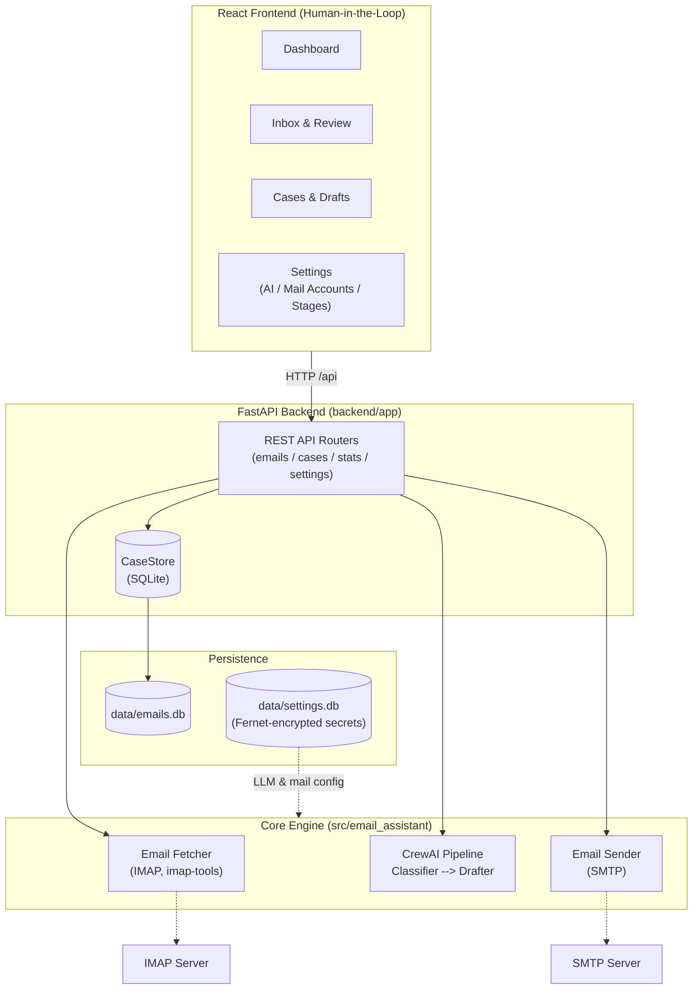

# PolyU — Agentic AI Email Assistant
> **Final Year Project** · Department of Computing  
> An intelligent email agent powered by **agentic AI** that autonomously receives, analyzes, classifies, and responds to emails. Enhanced with **Structured Output Validation** for reliable classification, with **RAG** and **MCP** integrations on the roadmap.

[](https://www.python.org/)
[](https://fastapi.tiangolo.com/)
[](https://react.dev/)
[](https://docs.crewai.com/v1.15.9/)
[](https://docs.pydantic.dev/)
[](https://www.sqlite.org/)

---

## Table of Contents
1. [Project Overview](#project-overview)
2. [Motivation & Objectives](#motivation--objectives)
3. [System Architecture](#system-architecture)
4. [CrewAI Multi-Agent Design & Structured Outputs](#crewai-multi-agent-design--structured-outputs)
5. [Core Workflow & Classification](#core-workflow--classification)
6. [Database & Persistence](#database--persistence)
7. [Key Highlights](#key-highlights)
8. [Project Structure](#project-structure)
9. [Getting Started](#getting-started)
10. [Configuration](#configuration)
11. [API Reference](#api-reference)
12. [Usage](#usage)
13. [Development](#development)
14. [Feature Roadmap](#feature-roadmap)
15. [Artifacts & Deliverables](#artifacts--deliverables)

---

## Project Overview

This project builds an **agentic AI email assistant** capable of autonomously managing email communication using a **deterministic fetch + multi-agent AI architecture**:

- **Python Fetcher (`core/email_fetcher.py`):** Deterministic IMAP email retrieval via `imap-tools` — no LLM tokens wasted on mechanical operations.
- **CrewAI (Core Engine):** Manages AI reasoning (Classifier → Drafter) in a sequential pipeline with Pydantic-validated structured outputs.
- **FastAPI Backend (`backend/app/`):** REST API for email sync, AI processing, case management, and runtime settings — all state persisted in SQLite.
- **React Frontend (`frontend/`):** Human-in-the-Loop UI for reviewing, editing, approving, and sending AI-generated drafts.

---

## Motivation & Objectives

In modern workplaces, professionals spend a significant portion of their day sorting and replying to emails. This project explores how **agentic AI** can:
1. **Reduce manual email overhead** by automating classification and drafting.
2. **Reduce LLM hallucinations** by enforcing structured outputs and (planned) grounding responses in real company data via RAG.
3. **Showcase Multi-Agent Collaboration** using CrewAI's role-based, sequential task architecture.
4. **Demonstrate Production-Ready AI** by implementing token safety caps, timeout handling, encrypted secret storage, and strict Human-in-the-Loop safety checks.
5. **Deliver a working FYP demo** that satisfies all academic requirements for autonomous task completion with measurable results.

---

## System Architecture



### Architecture Explained

The system separates deterministic and AI workloads:
1. **Sync** — the backend triggers the Python fetcher, which pulls unread emails via IMAP and stores them as deduplicated tickets in SQLite.
2. **Process** — the CrewAI crew (Classifier → Drafter) runs on a stored email; classification is validated against a Pydantic model (with a tolerant fallback parser for local models).
3. **Review & Send** — the human edits/approves the draft in the UI, then the backend sends it via SMTP using the enabled mail account.

---

## CrewAI Multi-Agent Design & Structured Outputs

The email processing pipeline consists of a deterministic Python fetch layer followed by a CrewAI crew of two AI agents:

### Pre-Processing: Email Fetcher

Email retrieval is handled by `core/email_fetcher.py` — a plain Python module that:
- Connects to IMAP (folder, max-emails configurable per mail account) and pulls unread emails
- Extracts structured metadata (sender, subject, body, timestamp) and inline attachments
- Passes cleaned data to the AI pipeline

This keeps LLM calls focused purely on reasoning tasks.

### Agent Roles

| Agent | Task | Goal | Tools |
| --- | --- | --- | --- |
| **Classifier** | `classify_email_task` | Determine category (question/incident/problem/task/spam), topic, priority, urgency, and summary. | None (LLM reasoning) |
| **Drafter** | `draft_reply_task` | Generate context-aware reply drafts matching professional tone. | (RAG/MCP planned) |

Each agent gets its own LLM instance with **per-stage overrides** (temperature, max tokens, even role/backstory) stored in the settings DB — YAML config in `config/agents.yaml` / `config/tasks.yaml` provides the defaults.

### Task Flow & Structured Validation

The classification task leverages **Pydantic Structured Outputs**, forcing the LLM to return strictly validated JSON. A tolerant fallback parser (`core/classification_parser.py`) recovers classifications from local models (e.g. Qwen3) that emit Python-literal style output instead of clean JSON.

```python
from pydantic import BaseModel, Field


class EmailClassification(BaseModel):
    category: str = Field(description="question, incident, problem, task, or spam")
    topic: str = Field(description="What the email is about, e.g. refund, bug_report, password_reset")
    priority: str = Field(description="low, normal, high, or urgent")
    urgency_score: int = Field(description="Urgency scale from 1 to 10")
    summary: str = Field(description="1-sentence summary of the email content")
    requires_reply: bool = Field(description="Whether a reply draft is needed")
```

> **Note:** `status` is intentionally **not** part of the AI classification
> output — it is a workflow state managed by humans/automations, not something
> the LLM should decide.

---

## Core Workflow & Classification

### Email (Ticket) Data Model

Each incoming email is treated as a **ticket**:

| Field | Meaning | Values | Set by |
| --- | --- | --- | --- |
| **status** | Lifecycle stage of the ticket | `new` → `processed` → `sent` (workflow states in DB) | Workflow (not AI) |
| **priority** | How urgent it is | `low` / `normal` / `high` / `urgent` | AI suggests, human can override |
| **category** | What *kind* of request it is (stable, small set) | `question` / `incident` / `problem` / `task` / `spam` | AI (classifier) |
| **topic** | What the email is *about* (open-ended subject matter) | `refund`, `bug_report`, `password_reset`, `lead`, … | AI (classifier) |
| **urgency_score / summary / requires_reply** | Auxiliary classification signals | 1–10 / text / bool | AI (classifier) |

### Email Classification Categories

The **category** field (what kind of request) is kept small and stable:

| Category | Description | Auto-Reply Strategy |
| --- | --- | --- |
| **question** | A question or request for information | Draft reply using knowledge base (planned: RAG FAQ) |
| **incident** | A single occurrence of a problem | Flag for human review, draft holding response |
| **problem** | A larger issue affecting many | Flag for human review |
| **task** | Assignable action item | Draft acceptance/tentative response |
| **spam** | Unsolicited or promotional | Flag, no reply |

---

## Database & Persistence

All state is persisted in two SQLite databases (auto-created on first run):

| Database | File | Contents |
| --- | --- | --- |
| **Email Store** | `data/emails.db` | Emails as tickets (sender, subject, body, classification fields, draft, sent timestamp) + inline attachments. IDs are content-hashed for dedupe. |
| **Settings Store** | `data/settings.db` | AI configs (single-active model, per-stage overrides), stage settings, mail accounts (IMAP/SMTP). |

**Secret handling:** API keys and mail passwords are encrypted at rest with **Fernet** (`cryptography`). The key comes from `SETTINGS_ENCRYPTION_KEY` or is auto-generated to `data/.secret_key`. Secrets are always masked in API responses (`has_api_key` / `has_password` booleans).

---

## Key Highlights

1. **Structured Output Validation**
* The classifier returns Pydantic-validated JSON; a tolerant fallback parser handles local-model quirks (code fences, Python literals), so classification never crashes the pipeline.

2. **Runtime-Editable Settings**
* LLM providers, per-stage parameters, and mail accounts are editable at runtime via the Settings UI and stored in SQLite (encrypted secrets) — no restart or `.env` editing required.

3. **Production-Ready LLM Guardrails (Timeout & Token Controls)**
* **Timeout Protection:** Configurable network timeouts prevent agents from freezing during heavy API loads.
* **Token Capping:** Per-stage max completion tokens control costs and prevent runaway responses from local models.
* **Test Connection:** Settings UI includes a live LLM connectivity test.

4. **Safety: Human-in-the-Loop**
* AI drafts are **never sent automatically** — every reply requires explicit human review, editing, and approval in the UI before SMTP dispatch.

---

## Project Structure

```plaintext
email_assistant/
├── .env.example                    # Environment variable template
├── .env                            # Active environment config (git-ignored)
├── pyproject.toml                  # Python dependencies (managed by uv)
├── pytest.ini
├── knowledge/
│   └── user_preference.txt         # Static knowledge base content
├── backend/
│   ├── app/
│   │   ├── main.py                 # FastAPI app factory, CORS, entry point (uv run api)
│   │   ├── schemas.py              # Pydantic request/response schemas
│   │   ├── store.py                # CaseStore wrapper over the email database
│   │   └── routers/
│   │       ├── emails.py           # Sync (IMAP fetch) + AI process endpoints
│   │       ├── cases.py            # Case listing, draft editing, SMTP send
│   │       ├── stats.py            # Dashboard statistics
│   │       └── settings.py         # AI configs / stage settings / mail accounts CRUD
│   └── tests/                      # FastAPI API tests (TestClient, temp DBs)
├── frontend/                       # React 19 + Vite + Tailwind 4 + shadcn/ui
│   ├── package.json                # npm scripts (dev / build / lint)
│   ├── vite.config.ts              # Dev server + /api proxy to backend
│   └── src/
│       ├── App.tsx                 # Route registration
│       ├── components/             # Sidebar, stat cards, badges, email body renderer
│       ├── lib/                    # API client, shared types
│       └── pages/
│           ├── dashboard.tsx       # Stats + category chart + recent activity
│           ├── inbox.tsx           # Email list, sync, AI process
│           ├── cases.tsx           # Draft review / edit / send
│           └── settings/           # ai.tsx, mail.tsx
├── tests/                          # Core unit tests (fetcher, database, parser, …)
└── src/
    └── email_assistant/
        ├── main.py                 # CLI entry points (run, train, test, replay)
        ├── models.py               # Pydantic models (EmailClassification)
        ├── service.py              # Multi-provider LLM configuration & validation
        ├── agents/
        │   └── crew.py             # @CrewBase: Classifier & Drafter + tasks
        ├── core/
        │   ├── email_fetcher.py    # Deterministic IMAP retrieval (imap-tools)
        │   ├── email_sender.py     # SMTP sending (SSL / STARTTLS)
        │   ├── email_service.py    # CLI-side fetch+process orchestration
        │   ├── database.py         # SQLite email store (tickets, attachments)
        │   ├── settings_store.py   # SQLite settings store (encrypted secrets)
        │   ├── classification_parser.py  # Tolerant classifier output parser
        │   └── stage_defaults.py   # YAML defaults + DB override merging
        ├── config/
        │   ├── agents.yaml         # Agent definitions (classifier, drafter)
        │   └── tasks.yaml          # Task definitions (classify → draft)
        └── tools/
            └── custom_tool.py      # Placeholder (to be replaced with real tools)
```

---

## Getting Started

### Prerequisites

- Python ≥ 3.10 with [uv](https://docs.astral.sh/uv/)
- Node.js ≥ 20 (for the frontend)

### 1. Clone & Install

```bash
git clone <repo-url>
cd email_assistant

# Install Python runtime and test dependencies using uv (creates .venv automatically)
uv sync --group dev

# Install frontend dependencies
cd frontend && npm install && cd ..
```

### 2. Configure Environment

```bash
cp .env.example .env
```

Edit `.env` with your credentials and safety constraints — or configure everything (LLM + mail accounts) at runtime through the Settings UI.

### 3. Run

```bash
# Terminal 1 — backend API (http://localhost:8000)
uv run api

# Terminal 2 — frontend dev server (http://localhost:5173, proxies /api to :8000)
cd frontend && npm run dev
```

Open `http://localhost:5173`.

---

## Configuration

Settings can be provided two ways: **`.env` defaults** and **runtime Settings UI** (stored in `data/settings.db`, overriding env).

### LLM Provider Selection

Set `LLM_PROVIDER` to exactly one of `local`, `openai`, `openrouter`, `anthropic`, `groq`, `deepseek`, or `google`. Only the selected provider is validated, so local mode does not require remote API keys. The active provider/model can also be switched at runtime in **Settings → AI**.

```dotenv
# Provider & safety guardrails
LLM_PROVIDER=local
LLM_TEMPERATURE=0.2
LLM_TIMEOUT=120
LLM_MAX_TOKENS=2000

# Local / OpenAI-compatible server (LM Studio, vLLM, llama.cpp, Ollama)
LOCAL_BASE_URL=http://localhost:11434/v1
LOCAL_MODEL=local-model
# LOCAL_API_KEY=sk-...           # Optional: for authenticated proxies/middleware

# OpenAI Example
# OPENAI_API_KEY=sk-...
# OPENAI_BASE_URL=https://api.openai.com/v1
# OPENAI_MODEL=gpt-4o-mini

# Anthropic Example
# ANTHROPIC_API_KEY=sk-ant-...
# ANTHROPIC_MODEL=claude-3-5-sonnet-20241022

# Google Gemini Example
# GOOGLE_API_KEY=...
# GOOGLE_MODEL=gemini-2.0-flash

# (also supported: openrouter, groq, deepseek — see .env.example)
```

### Email Configuration (IMAP)

Set in `.env` for the default account, or manage multiple accounts at runtime in **Settings → Mail Accounts** (address, IMAP/SMTP host + port, folder, max emails, enable toggle). Gmail requires an App Password.

```dotenv
EMAIL_ENABLED=false
EMAIL_SERVER=imap.gmail.com
EMAIL_PORT=993
EMAIL_ADDRESS=
EMAIL_PASSWORD=your-app-password   # Use Google App Password
EMAIL_FOLDER=INBOX
EMAIL_MAX_EMAILS=50
```

> **Folder naming:** use the exact IMAP mailbox name (e.g. `INBOX`). Sub-folders use the server's hierarchy separator (`INBOX.Subfolder` or `INBOX/Subfolder`) — not spaces.

### API Server

```dotenv
API_HOST=0.0.0.0
API_PORT=8000
CORS_ORIGINS=http://localhost:5173,http://127.0.0.1:5173

# Frontend (frontend/.env)
# VITE_PORT=5173
# VITE_API_TARGET=http://localhost:8000
```

### Persistence & Secrets

```dotenv
SQLITE_SETTINGS_DB=data/settings.db
# SQLITE_EMAIL_DB=data/emails.db          (default shown)
# SETTINGS_ENCRYPTION_KEY=...             # Optional Fernet key; auto-generated to data/.secret_key

# Embeddings (planned RAG)
EMBEDDING_PROVIDER=ollama
EMBEDDING_BASE_URL=http://localhost:11434
EMBEDDING_MODEL=qwen3-embedding-4b
```

---

## API Reference

Base URL: `http://localhost:8000/api`

| Method | Path | Purpose |
| --- | --- | --- |
| GET | `/health` | Health check |
| GET | `/emails` | List stored emails |
| POST | `/emails/sync` | Fetch unread emails via IMAP (502 on IMAP failure) |
| POST | `/emails/{id}/process` | Run the CrewAI pipeline (classify + draft) on an email |
| GET | `/emails/{id}/attachments/{cid}` | Serve an inline attachment |
| GET | `/cases` | List processed cases |
| PATCH | `/cases/{id}` | Edit a draft reply |
| POST | `/cases/{id}/send` | Send the approved draft via SMTP |
| GET | `/stats` | Dashboard statistics (totals, category distribution, activity) |
| GET/POST | `/settings/ai` | List / create AI configs |
| PUT/DELETE | `/settings/ai/{id}` | Update / delete an AI config |
| POST | `/settings/ai/{id}/activate` | Set the active AI config (single-active) |
| POST | `/settings/ai/test` · `/settings/ai/{id}/test` | LLM connection test |
| GET/PUT | `/settings/stages` | Per-stage settings (classification / draft) |
| GET/POST | `/settings/mail` | List / create mail accounts |
| PUT/DELETE | `/settings/mail/{id}` | Update / delete a mail account |

---

## Usage

### Web UI (primary workflow)

1. **Settings → Mail Accounts** — add your IMAP/SMTP account (folder must be a valid IMAP mailbox name, e.g. `INBOX`).
2. **Settings → AI** — configure an LLM provider (use *Test Connection* to verify), then activate it.
3. **Inbox → Sync** — pull unread emails via IMAP into the ticket store.
4. **Inbox → Process** — run the Classifier → Drafter pipeline on an email.
5. **Cases** — review the classification and draft, edit if needed, then **Send** via SMTP.

### CLI Mode

```bash
uv run crewai run
```

Runs the full pipeline: `fetch_emails()` → Classifier → Drafter. The classification result is
validated against the `EmailClassification` Pydantic model, and the final draft
is written to `draft_reply.txt` (git-ignored runtime artifact).

---

## Development

### Run Tests

```bash
uv run pytest            # 102 tests (core + backend API), no real API calls required
```

### Lint & Format

```bash
uv run ruff check .
uv run ruff format .

# Frontend
cd frontend && npm run lint
```

### Dependency Management

```bash
uv add <package>         # Add a Python dependency
uv sync                  # Sync environment
```

---

## Feature Roadmap

* [x] Refactor to pure CrewAI structure (`crewai create crew`)
* [x] Multi-provider LLM configuration with timeout & token safety guards
* [x] YAML-based Agent & Task definitions (Classifier, Drafter)
* [x] Pydantic structured output (`EmailClassification`) + tolerant fallback parser
* [x] Optional `LOCAL_API_KEY` support for authenticated local proxies
* [x] Decouple email fetching from AI agents (`core/email_fetcher.py`)
* [x] Real IMAP email retrieval (`imap-tools`)
* [x] FastAPI backend (sync / process / cases / send / stats / settings)
* [x] React frontend (Dashboard / Inbox / Cases / Settings)
* [x] SQLite email store — tickets, drafts, attachments (content-hash dedupe)
* [x] SQLite settings store — AI configs, stage settings, mail accounts
* [x] Encrypted secret storage (Fernet) for API keys & mail passwords
* [x] SMTP sending of approved drafts (SSL / STARTTLS)
* [ ] Email (ticket) data model — per-mailbox custom fields
* [ ] CrewAI long-term memory via SQLite (`memory=True`)
* [ ] ChromaDB RAG integration — index past emails and FAQs
* [ ] Embedding pipeline — chunk documents, generate embeddings, store in ChromaDB
* [ ] MockEmailService — simulated inbox for offline testing
* [ ] MCP Server integration for local file access
* [ ] Settings additions — Topics, Custom Fields, Knowledge/RAG, MCP Connectors, Roles / Users / Teams
* [ ] Final FYP Report & Evaluation generation

---

## Artifacts & Deliverables

Per FYP requirements, the following artifacts will be submitted:

1. **Source Code:** Modular Python + TypeScript system using modern tooling (uv, CrewAI, FastAPI, React/Vite).
2. **Agent Configurations:** Detailed YAML files outlining Agent cognitive pathways.
3. **Demo Application:** Web dashboard demonstrating end-to-end automation with safety controls.
4. **Evaluation Report:** Statistical analysis of classification accuracy and RAG hit rate.
