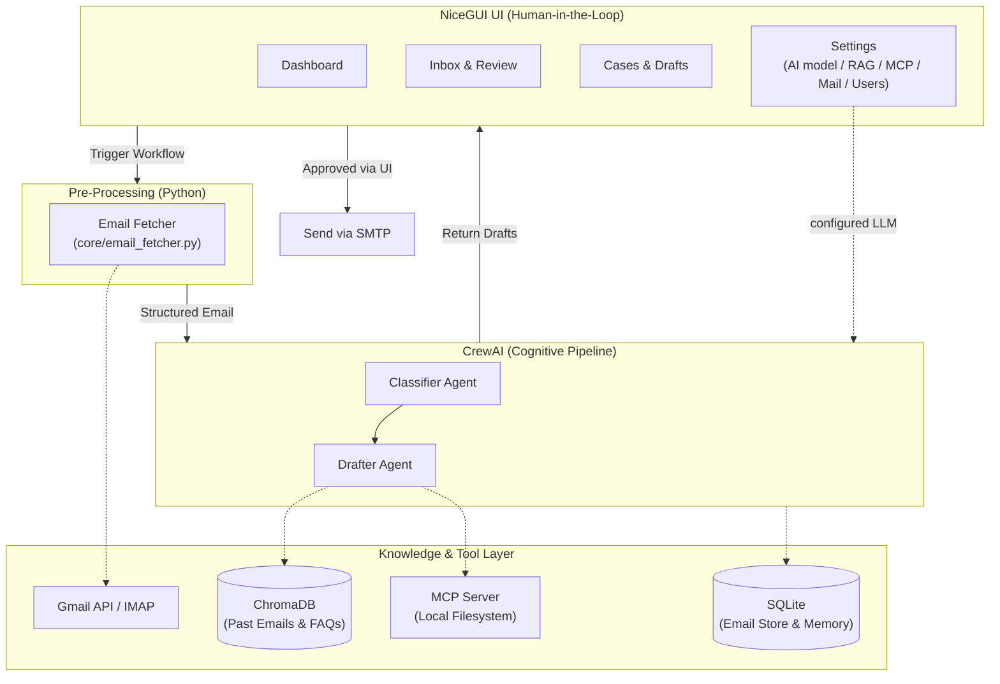
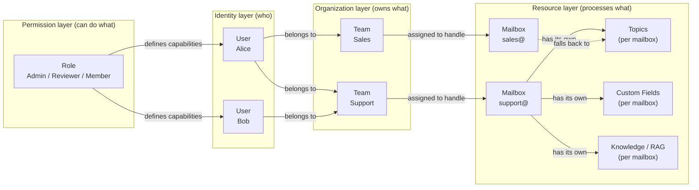
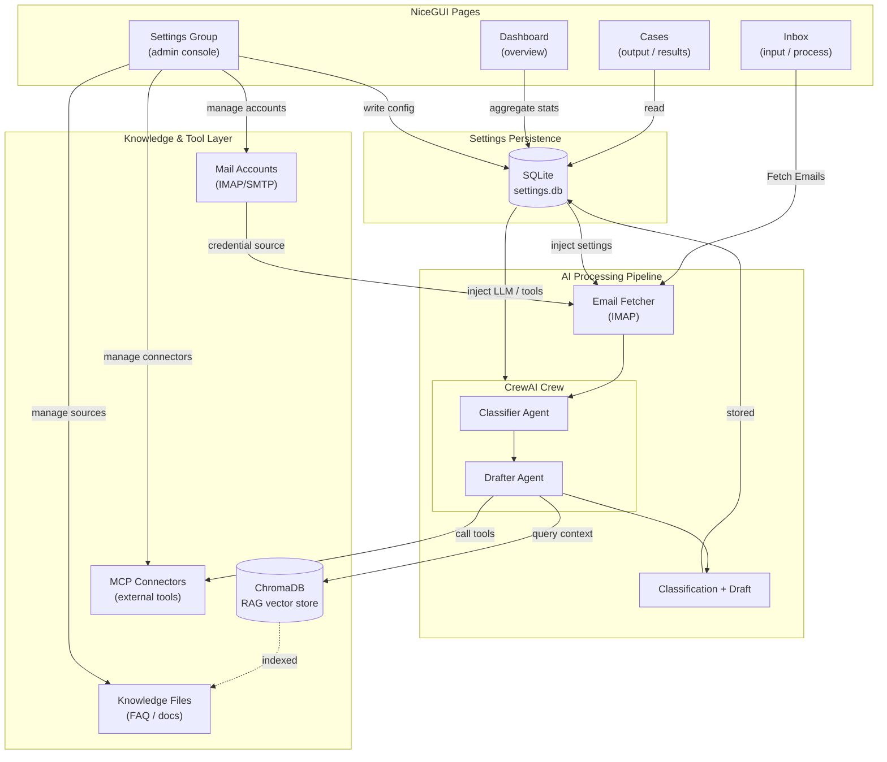
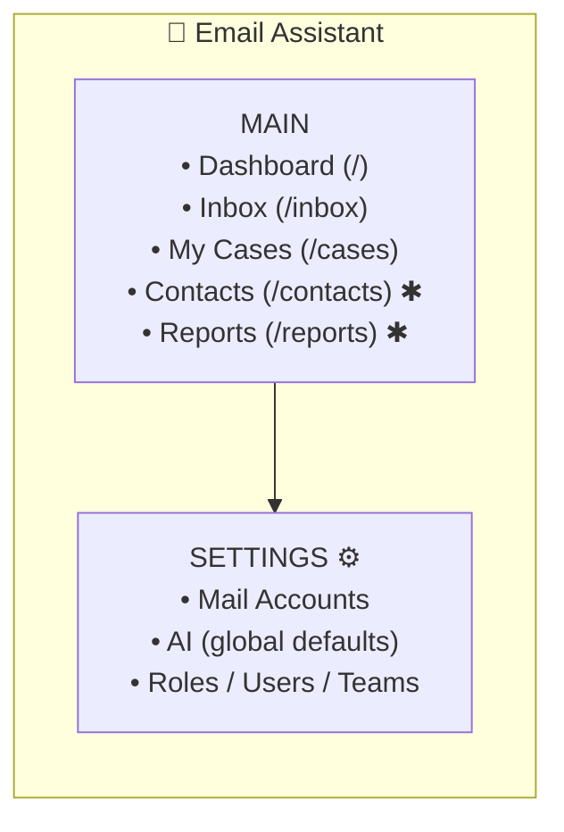
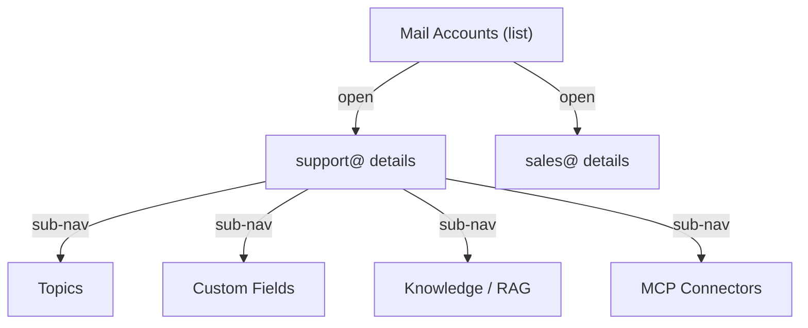

# PolyU — Agentic AI Email Assistant
> **Final Year Project** · Department of Computing  
> An intelligent email agent powered by **agentic AI** that autonomously receives, analyzes, classifies, and responds to emails. Enhanced with **RAG (Retrieval-Augmented Generation)**, **Structured Output Validation**, and the **Model Context Protocol (MCP)** for secure, context-aware enterprise workflows.

[](https://www.python.org/)
[](https://docs.crewai.com/v1.15.9/)
[](https://docs.pydantic.dev/)
[](https://www.sqlite.org/)
[](https://www.trychroma.com/)
[](https://modelcontextprotocol.io/)
[](https://nicegui.io/)

---

## Table of Contents
1. [Project Overview](#project-overview)
2. [Motivation & Objectives](#motivation--objectives)
3. [System Architecture](#system-architecture)
4. [CrewAI Multi-Agent Design & Structured Outputs](#crewai-multi-agent-design--structured-outputs)
5. [Core Workflow & Classification](#core-workflow--classification)
6. [Database & Knowledge Layer](#database--knowledge-layer)
7. [RAG, MCP & LLM Resilience (Key Highlights)](#rag-mcp--llm-resilience-key-highlights)
8. [Privacy, Security & Evaluation](#privacy-security--evaluation)
9. [Project Structure](#project-structure)
10. [Getting Started](#getting-started)
11. [Configuration](#configuration)
12. [Usage](#usage)
13. [Development](#development)
14. [UI & Admin Settings Plan](#ui--admin-settings-plan)
15. [Feature Roadmap](#feature-roadmap)
16. [Artifacts & Deliverables](#artifacts--deliverables)

---

## Project Overview

This project builds an **agentic AI email assistant** capable of autonomously managing email communication using a **deterministic fetch + multi-agent AI architecture**. Email retrieval (IMAP) is handled by a lightweight Python layer, while AI-powered classification and drafting are delegated to a crew of specialized agents.

To maintain simplicity, reliability, and ease of debugging, this project leverages a **CrewAI-Native Architecture**:
- **Python Fetcher:** Deterministic IMAP email retrieval — no LLM tokens wasted on mechanical operations.
- **CrewAI (Core Engine):** Manages AI reasoning (Classifier, Drafter) and tool execution in a sequential pipeline.
- **NiceGUI (Human-in-the-Loop):** Acts as the UI layer, pausing the final dispatch to allow users to review, edit, approve, or reject AI-generated drafts.

---

## Motivation & Objectives

In modern workplaces, professionals spend a significant portion of their day sorting and replying to emails. This project explores how **agentic AI** can:
1. **Reduce manual email overhead** by automating classification and drafting.
2. **Eliminate LLM Hallucinations** by grounding AI responses in real company data via RAG.
3. **Showcase Multi-Agent Collaboration** using CrewAI's role-based, sequential task architecture.
4. **Demonstrate Production-Ready AI** by implementing token safety caps, timeout handling, and strict Human-in-the-Loop safety checks.
5. **Deliver a working FYP demo** that satisfies all academic requirements for autonomous task completion with measurable results.

---

## System Architecture



### Architecture Explained

The system separates deterministic and AI workloads:
1. **Python Fetcher** retrieves emails via IMAP and outputs structured metadata.
2. **CrewAI** handles the AI pipeline (Classify → Draft) sequentially.
3. **NiceGUI** catches the draft, renders it for human approval, then sends via SMTP.

---

## CrewAI Multi-Agent Design & Structured Outputs

The email processing pipeline consists of a deterministic Python fetch layer followed by a CrewAI crew of two AI agents:

### Pre-Processing: Email Fetcher

Email retrieval is handled by `core/email_fetcher.py` — a plain Python module that:
- Connects to IMAP/Gmail API to pull unread emails
- Extracts structured metadata (sender, subject, body, timestamp)
- Passes cleaned data to the AI pipeline

This keeps LLM calls focused purely on reasoning tasks.

### Agent Roles

| Agent Role | Goal | Tools |
| --- | --- | --- |
| **Classifier** | Determine category (question/incident/problem/task/spam), topic, and priority; produce a summary. | None (LLM reasoning) |
| **Drafter** | Generate context-aware reply drafts matching professional tone. | RAG, MCP tools |

### Task Flow & Structured Validation

To ensure high system reliability, the classification task leverages **Pydantic Structured Outputs**, forcing the LLM to return strictly validated JSON data rather than unstructured text.

```python
from pydantic import BaseModel, Field


class EmailClassification(BaseModel):
    category: str = Field(description="question, incident, problem, task, or spam")
    topic: str = Field(description="What the email is about, e.g. refund, bug_report, password_reset")
    priority: str = Field(description="low, normal, high, or urgent")
    urgency_score: int = Field(description="Urgency scale from 1 to 10")
    summary: str = Field(description="1-sentence summary of the email content")
    requires_reply: bool = Field(description="Whether a reply draft is needed")
    custom: dict = Field(default_factory=dict, description="Per-mailbox custom field values")
```

> **Note:** `status` is intentionally **not** part of the AI classification
> output — it is a workflow state managed by humans/automations, not something
> the LLM should decide.

---

## Core Workflow & Classification

### Email (Ticket) Data Model

Each incoming email is treated as a **ticket** with two kinds of fields,
following the industry-standard helpdesk model (Zendesk, Freshdesk, ServiceNow):

**Standard fields** — present on every email/ticket:

| Field | Meaning | Values | Set by |
| --- | --- | --- | --- |
| **status** | Lifecycle stage of the ticket | `new` → `open` → `pending` → `solved` → `closed` | Workflow / agent (not AI) |
| **priority** | How urgent it is | `low` / `normal` / `high` / `urgent` | AI suggests, agent can override |
| **category** | What *kind* of request it is (stable, small set) | `question` / `incident` / `problem` / `task` / `spam` | AI (classifier) |
| **topic** | What the email is *about* (open-ended subject matter) | `refund`, `bug_report`, `password_reset`, `lead`, … | AI (classifier) |

**Custom fields** — defined per mailbox by an admin, extending the ticket:

| Example | Type | Scope |
| --- | --- | --- |
| `product_name` | dropdown | support@ |
| `order_number` | text | support@ |
| `deal_value` | number | sales@ |

> **Why this split?** `status` is a workflow state that humans/automations
> update — it is **not** something the LLM should invent. `category` is a small,
> stable enumeration; `topic` is free-form and mailbox-scoped (a support mailbox
> gets `refund`/`bug_report`, a sales mailbox gets `lead`/`proposal`). Custom
> fields let each mailbox collect its own structured data.

### Email Classification Categories

The **category** field (what kind of request) is kept small and stable:

| Category | Description | Auto-Reply Strategy |
| --- | --- | --- |
| **question** | A question or request for information | Draft reply using RAG (FAQ knowledge base) |
| **incident** | A single occurrence of a problem | Flag for human review, draft holding response |
| **problem** | A larger issue affecting many | Flag for human review |
| **task** | Assignable action item | Draft acceptance/tentative response |
| **spam** | Unsolicited or promotional | Move to spam folder |

**Topic** is the open-ended classification (what the email is about) and is
defined per mailbox — see [UI & Admin Settings Plan](#ui--admin-settings-plan).

---

## Database & Knowledge Layer

The project uses the following data stores:

### SQLite — Email Storage & CrewAI Memory

| Database | File | Purpose | Status |
| --- | --- | --- | --- |
| **Email Store** | `data/emails.db` | Persist fetched emails as tickets (sender, subject, body, status, priority, category, topic, custom fields, reply draft) for UI rendering and history. | 🔜 Pending |
| **Settings Store** | `data/settings.db` | Persist admin configuration (AI, mail accounts, topics, fields, roles, users, teams). See [UI & Admin Settings Plan](#ui--admin-settings-plan). | 🔜 Pending |
| **CrewAI Long-Term Memory** | `data/crew_memory.db` | SQLite-backed long-term memory for CrewAI, persisting agent insights across sessions. Enable with `memory=True` on the Crew. | 🔜 Pending |

### ChromaDB — RAG Vector Store

| Component | Purpose | Status |
| --- | --- | --- |
| **Past Emails Index** | Embed and index historical emails for context-aware reply generation. | 🔜 Pending |
| **FAQ Knowledge Base** | Index company FAQs and policy documents to ground AI responses and eliminate hallucinations. | 🔜 Pending |
| **Embedding Provider** | Configurable via `EMBEDDING_PROVIDER` (ollama / openai). Local embeddings keep all data on-premises. | Config ready |

> **Scope note:** Knowledge sources are **per-mailbox** in the planned model —
> support@ queries its own FAQ/docs, sales@ its own. See
> [UI & Admin Settings Plan](#ui--admin-settings-plan).

### Database Configuration (Planned)

```dotenv
# SQLite paths (auto-created on first run)
SQLITE_EMAIL_DB=data/emails.db
SQLITE_SETTINGS_DB=data/settings.db
SQLITE_MEMORY_DB=data/crew_memory.db

# ChromaDB (RAG vector store)
CHROMA_PERSIST_DIR=data/chroma_db
CHROMA_COLLECTION_NAME=email_knowledge

# Embedding model for RAG
EMBEDDING_PROVIDER=ollama
EMBEDDING_BASE_URL=http://localhost:11434
EMBEDDING_MODEL=qwen3-embedding-4b
```

---

## RAG, MCP & LLM Resilience (Key Highlights)

To elevate this project from a standard wrapper to an advanced AI application:

1. **Retrieval-Augmented Generation (RAG) & Embedding**
* Queries ChromaDB vector storage (with configurable chunks and embedding dimensions) to retrieve accurate context and FAQ snippets, completely eliminating LLM hallucinations.


2. **Model Context Protocol (MCP)**
* Safely exposes specific local directories to the Drafter Agent for secure, standardized file reading.


3. **Production-Ready LLM Guardrails (Timeout & Token Controls)**
* **Timeout Protection:** Configured with strict network timeouts to prevent agents from freezing during heavy API loads.
* **Token Capping:** Enforces maximum completion tokens to control costs and prevent runaway responses (hallucination loops) from local models.


---

## Privacy, Security & Evaluation

* **Zero Data Retention:** API calls to cloud providers use zero-retention headers where applicable.
* **Local Model Support:** Seamlessly switch to Ollama or local backends (e.g., Qwen) for secure processing of sensitive correspondence.
* **Evaluation Metrics:** System benchmarks on a test dataset measuring Classification Accuracy (>90%), RAG Hit Rate (>85%), and Human Acceptance Rate (HAR).

---

## Project Structure

```plaintext
email_assistant/
├── .env.example                  # Environment variable template
├── .env                          # Active environment config (git-ignored)
├── pyproject.toml                # Project dependencies (managed by uv)
├── pytest.ini                    # NiceGUI user-plugin test fixtures
├── README.md
├── knowledge/
│   └── user_preference.txt       # Static knowledge base content
├── tests/
│   ├── test_crew.py              # Crew assembly tests (LLM sharing)
│   └── test_service.py           # LLM provider configuration tests
├── web/                          # NiceGUI frontend (Python-only)
│   ├── main.py                   # Entry point + route registration (ui.run)
│   ├── layout.py                 # Shared drawer / header / nav shell
│   ├── components/               # Reusable UI components (stat cards, badges)
│   ├── pages/
│   │   ├── dashboard.py          # Dashboard (stats, tables, charts)
│   │   ├── inbox.py              # Email list + AI processing
│   │   └── cases.py              # Processed cases + drafts
│   └── test_pages.py             # NiceGUI UI integration tests
└── src/
    └── email_assistant/
        ├── __init__.py
        ├── main.py               # Entry points (run, train, test, replay, trigger)
        ├── models.py             # Pydantic models (EmailClassification)
        ├── service.py            # Multi-provider LLM configuration & validation
        ├── agents/
        │   ├── __init__.py
        │   └── crew.py           # @CrewBase: Classifier & Drafter agents + tasks
        ├── core/
        │   ├── __init__.py
        │   ├── email_fetcher.py  # Deterministic IMAP retrieval + sample data
        │   ├── email_service.py  # Processing orchestration layer
        │   └── database.py       # SQLite persistence layer (planned)
        ├── config/
        │   ├── agents.yaml       # Agent definitions (classifier, drafter)
        │   └── tasks.yaml        # Task definitions (classify → draft)
        └── tools/
            ├── __init__.py
            └── custom_tool.py    # Placeholder (to be replaced with real tools)
```

> **Future layout:** The planned `Settings` and admin resources (AI, RAG, MCP,
> Mail Accounts, Fields, Roles, Users, Team) will follow the **resource pattern**
> (list → create → edit pages backed by tables/forms) described in
> [UI & Admin Settings Plan](#ui--admin-settings-plan).

---

## Getting Started

### 1. Clone & Install

```bash
git clone <repo-url>
cd email_assistant

# Install runtime and test dependencies using uv (creates .venv automatically)
uv sync --group dev

```

### 2. Configure Environment

```bash
cp .env.example .env

```

Edit `.env` with your credentials and safety constraints.

---

## Configuration

All settings use environment variables. Set `LLM_PROVIDER` to exactly one of
`local`, `openai`, `openrouter`, `anthropic`, `groq`, `deepseek`, or `google`.
Only the selected provider is validated, so local mode does not require remote
API keys.

### LLM Provider Selection

```dotenv
# Provider & safety guardrails
LLM_PROVIDER=local
LLM_TEMPERATURE=0.2
LLM_TIMEOUT=120
LLM_MAX_TOKENS=2000

# Local / OpenAI-compatible server (LM Studio, vLLM, llama.cpp, Ollama)
LOCAL_BASE_URL=http://localhost:11434/v1
LOCAL_MODEL=local-model
# LOCAL_API_KEY=sk-...           # Optional: for authenticated proxies/middleware

# OpenRouter Example
# OPENROUTER_API_KEY=sk-or-v1-xxxx
# OPENROUTER_BASE_URL=https://openrouter.ai/api/v1
# OPENROUTER_MODEL=openai/gpt-4o-mini

# OpenAI Example
# OPENAI_API_KEY=sk-...
# OPENAI_BASE_URL=https://api.openai.com/v1
# OPENAI_MODEL=gpt-4o-mini

# Anthropic Example
# ANTHROPIC_API_KEY=sk-ant-...
# ANTHROPIC_BASE_URL=https://api.anthropic.com
# ANTHROPIC_MODEL=claude-3-5-sonnet-20241022

# Groq Example
# GROQ_API_KEY=gsk_...
# GROQ_BASE_URL=https://api.groq.com/openai/v1
# GROQ_MODEL=llama-3.3-70b-versatile

# DeepSeek Example
# DEEPSEEK_API_KEY=sk-...
# DEEPSEEK_BASE_URL=https://api.deepseek.com
# DEEPSEEK_MODEL=deepseek-chat

# Google Gemini Example
# GOOGLE_API_KEY=...
# GOOGLE_MODEL=gemini-2.0-flash

```

### Email Configuration (IMAP)

```dotenv
# IMAP inbox access (Gmail requires an App Password)
EMAIL_ENABLED=false
EMAIL_SERVER=imap.gmail.com
EMAIL_PORT=993
EMAIL_ADDRESS=
EMAIL_PASSWORD=your-app-password   # Use Google App Password
EMAIL_FOLDER=INBOX
EMAIL_MAX_EMAILS=50
```

### RAG & Embedding Configuration (Planned)

```dotenv
EMBEDDING_PROVIDER=ollama
EMBEDDING_BASE_URL=http://localhost:11434
EMBEDDING_MODEL=qwen3-embedding-4b

```

### Database Configuration (Planned)

```dotenv
# SQLite
SQLITE_EMAIL_DB=data/emails.db
SQLITE_SETTINGS_DB=data/settings.db
SQLITE_MEMORY_DB=data/crew_memory.db

# ChromaDB
CHROMA_PERSIST_DIR=data/chroma_db
CHROMA_COLLECTION_NAME=email_knowledge

```

---

## Usage

### CLI Mode

```bash
uv run crewai run

```

Runs the full pipeline: `fetch_emails()` → Classifier → Drafter. Processes all
sample emails defined in `core/email_fetcher.py`. The classification result is
validated against the `EmailClassification` Pydantic model, and the final draft
is written to `draft_reply.txt` (git-ignored runtime artifact).

### Web UI (NiceGUI)

```bash
uv run web

# or, equivalently:
uv run python web/main.py

```

Open `http://localhost:8080`. The Filament-style interface provides:

- **Dashboard** (`/`) — stats overview, recent activity, category charts
- **Inbox** (`/inbox`) — fetch emails, view content, run AI processing
- **Cases** (`/cases`) — processed emails with AI drafts and classifications

Blocking work (IMAP fetch, CrewAI kickoff) runs off the event loop via
`nicegui.run.io_bound`, so the UI stays responsive.

---

## Development

### Run Tests

```bash
uv run pytest            # 42 tests, no API calls required
```

### Lint & Format

```bash
uv run ruff check .
uv run ruff format .

```

### Dependency Management

```bash
uv add <package>         # Add a new dependency
uv sync                  # Sync environment

```

---

## UI & Admin Settings Plan

> Design reference for the administrative interface. Modeled on how production
> admin panels (Filament, HubSpot, Front, Gmail) organize settings and resources,
> reimplemented in NiceGUI (pure Python).

### Design Principles (from industry research)

| Product | Approach |
| --- | --- |
| **Filament** | Every entity is a **Resource**: a List page + Create/Edit pages backed by a table and a form. Settings are grouped under navigation groups. |
| **HubSpot** | Settings is a single hub with **sections on the left** (Account, Users & Teams, Data Management, Integrations) and grouped config forms on the right. |
| **Front / Missive** | Shared **Team Inbox** concept: channels (mail accounts) are first-class resources, rules/automations are separate, and settings is sectioned. |
| **Gmail / Outlook** | Gear icon → full-screen settings **drawer with left sections**, each section one concern (Accounts, Labels, General, Filters). |

**Shared takeaways:**

1. **Settings is never one giant page.** It is a *group* of pages, each owning one concern (AI, RAG, MCP, Mail, Users…).
2. **CRUD resources** (Users, Roles, Mail Accounts, MCP Connectors, Fields, Topics, Team) follow the same pattern: **List → Create → Edit**, driven by a table + form.
3. **Navigation has two zones**: primary pages (Dashboard / Inbox / Cases) and a **settings group** pinned at the bottom of the drawer.
4. **Configuration is persisted**, not hard-coded in `.env` — admin edits at runtime are stored in SQLite and override env defaults.
5. **Two levels of scope**: 🌐 **Global** (org-wide defaults) vs 📮 **Per-Mailbox** (the processing context). When an email arrives, it is processed with *its mailbox's* knowledge, tools, and topics, falling back to global defaults.

### Access-Control & Data Model

The relationship between users, teams, roles, mailboxes, and topics:



**Roles and responsibilities:**

| Entity | Answers | Example |
| --- | --- | --- |
| **User** | Who? | Alice, Bob |
| **Role** | What can they do (capability)? | Admin edits settings; Reviewer approves drafts; Member views/processes |
| **Team** | What do they own (scope)? | Support team → support@; Sales team → sales@ |
| **Mailbox** | Processing context | support@ has its own Topics, custom Fields, Knowledge, MCP tools |
| **Topic** | Classification dictionary (what an email is about) | refund / bug_report / password_reset / lead … |
| **Field** | Per-mailbox custom ticket field | product_name, order_number, deal_value |

**Key relationships (all many-to-many):**

- **User ↔ Role**: one user can have multiple roles (Alice = Support Member + company Admin).
- **User ↔ Team**: one user can belong to multiple teams.
- **Team ↔ Mailbox**: one team can handle multiple mailboxes — **this defines access scope**.
- **Mailbox ↔ Topic / Field / Knowledge / MCP**: each mailbox owns its own classification dictionary, custom fields, knowledge sources, and tools, with **global fallback**.

**Permission check for a single email:**

```python
def can_access(email, user):
    mailbox = email.mailbox            # support@
    teams = team_of(mailbox)           # [Support team]
    if user not in members_of(teams):  # scope check
        return False
    return capability_of(user)         # what they can do → from their Roles
```

**Why not just attach a Role directly to a User?**

| | ❌ Role directly on User | ✅ User → Team → Mailbox |
| --- | --- | --- |
| Access scope | Global (sees every mailbox) | Only the mailboxes their team handles |
| Multi-mailbox | Cannot distinguish per-mailbox rights | Natural mapping |
| New mailbox | Must edit every user | Just assign to a team |
| Real-world fit | Unrealistic | Matches reality (support only handles support@) |

**Topics & Fields are mailbox-scoped.** Topics are the *classification
dictionary* (what an email is about) for a mailbox, not a user/team attribute.
A support mailbox may define `refund` and `bug_report` topics; a sales mailbox
defines `lead` and `proposal`. **Fields** are custom ticket fields an admin adds
to a specific mailbox (`product_name`, `deal_value`, …). Teams consume the
topics/fields of the mailboxes they own, and only an **Admin** role can edit
them.

### Page-to-Backend Data Flow



### Proposed Sidebar (NiceGUI `ui.left_drawer`)



> ✱ = reserved slots; render empty-state pages until implemented.

- **Main group** stays visible and short.
- **Settings** is a collapsible section (`ui.expansion` in the drawer) so the drawer stays clean.
- **Mailbox-scoped configs** (Topics, Fields, Knowledge/RAG, MCP) live **inside each Mail Account** via sub-navigation, not at the top level:



### Settings Modules (one page per concern)

**🌐 Global scope (top-level settings):**

| Route | Module | Key fields |
| --- | --- | --- |
| `/settings/mail` | **Mail Accounts** | address, IMAP/SMTP host+port, password (masked), folder, max emails, enabled toggle |
| `/settings/ai` | **AI Settings** | provider, model, base URL, API key (masked/encrypted), temperature, max tokens, timeout; **Test Connection** |
| `/settings/roles` | **Roles** | name, permissions (which settings sections are accessible) |
| `/settings/users` | **Users** | name, email, active; team membership + role assignment |
| `/settings/team` | **Teams** | team name; member assignment + mailbox ownership |

**📮 Per-mailbox scope (sub-navigation inside each Mail Account):**

| Route (nested) | Module | Key fields |
| --- | --- | --- |
| `/settings/mail/{id}/topics` | **Topics** | classification dictionary: topic name, color, auto-reply strategy |
| `/settings/mail/{id}/fields` | **Custom Fields** | dynamic ticket fields: label, key, type (text/dropdown/number/checkbox/date) |
| `/settings/mail/{id}/knowledge` | **Knowledge / RAG** | vector store status, embedding provider/model, **Sources** table (PDF/MD/TXT/CSV), **Re-index** button |
| `/settings/mail/{id}/mcp` | **MCP Connectors** | name, transport (`stdio`/`http`), command/args or URL, enabled toggle, **Test** handshake |

> Mailbox-scoped modules fall back to 🌐 global defaults when not configured.

**Email (ticket) fields recap** — every email has standard fields
(`status`, `priority`, `category`, `topic`) plus the mailbox's custom
fields. See [Core Workflow & Classification](#core-workflow--classification).

### Implementation Pattern (NiceGUI)

**Route registration** (`web/main.py`):

```python
@ui.page("/settings/ai")
def settings_ai_page() -> None:
    create_layout("AI Settings", active="settings")
    from web.settings import ai
    ai.render()
```

**CRUD resource skeleton** — every settings resource reuses the same shape:

```python
@ui.refreshable
def table() -> None:
    ui.table(columns=columns, rows=rows, row_key="id")

def open_form(record=None) -> None:
    with ui.dialog() as dialog, ui.card():
        # fields bound to a dataclass; Save → SQLite → table.refresh()
        pass
```

**Persistence:**

- SQLite (`data/settings.db`) via the `Database` layer in `src/email_assistant/core/database.py`.
- Env vars remain the *defaults*; DB overrides apply at runtime.
- API keys stored encrypted (e.g. `cryptography` Fernet, key from env).

**Key NiceGUI rules:**

1. **Never block the event loop** — use `run.io_bound()` for DB / IMAP / CrewAI work.
2. **Per-user state** via `app.storage.user`; settings loaded into a cached singleton.
3. **Refreshables not rebuilds** — update tables with `@ui.refreshable` + `.refresh()`.
4. **Tailwind classes** for styling — drawer nav uses `ui.list` / `ui.item`; forms use `ui.input`, `ui.select`, `ui.toggle`.

### Recommended Implementation Order

1. **Settings shell** — drawer group + `/settings` landing page (empty-state cards).
2. **Mail Accounts** — CRUD; the anchor resource (mailbox-scoped configs hang off it).
3. **AI Settings** (global) — read/write SQLite, wire into `create_llm()`, Test button.
4. **Topics & Custom Fields** (per-mailbox + global fallback) — CRUD, feed into classification task context.
5. **Roles / Users / Teams** — CRUD + many-to-many assignment (display-only auth for now).
6. **Knowledge / RAG** (per-mailbox) — source table + re-index background task.
7. **MCP Connectors** (per-mailbox) — CRUD + test handshake.
8. **Emails table** — persist tickets with standard fields; wire Inbox/Cases to read/write.
9. **Primary additions** — My Cases (filters), Contacts, Reports (charts).

### Database Schema Sketch

**Emails (tickets) — `data/emails.db`:**

```sql
CREATE TABLE emails (
    id INTEGER PRIMARY KEY,
    mail_account_id INTEGER REFERENCES mail_accounts(id),
    sender TEXT NOT NULL,
    subject TEXT,
    body TEXT,
    received_at TEXT,

    -- standard ticket fields
    status TEXT DEFAULT 'new',        -- new | open | pending | solved | closed
    priority TEXT DEFAULT 'normal',   -- low | normal | high | urgent
    category TEXT,                    -- question | incident | problem | task | spam
    topic TEXT,                       -- what the email is about
    urgency_score INTEGER,
    summary TEXT,
    requires_reply INTEGER DEFAULT 0,

    draft_reply TEXT,                 -- AI-generated draft (approved by human)
    sent_at TEXT                      -- when the approved draft was sent
);

-- Custom field values (per mailbox custom fields applied to a ticket)
CREATE TABLE email_custom_field_values (
    email_id INTEGER REFERENCES emails(id),
    field_id INTEGER REFERENCES custom_fields(id),
    value TEXT,
    PRIMARY KEY (email_id, field_id)
);
```

**Settings & config — `data/settings.db`:**

```sql
CREATE TABLE settings (
    key TEXT PRIMARY KEY,      -- e.g. 'ai.provider', 'ai.model' (global defaults)
    value TEXT
);

CREATE TABLE mail_accounts (
    id INTEGER PRIMARY KEY,
    address TEXT NOT NULL,
    imap_host TEXT, imap_port INTEGER,
    smtp_host TEXT, smtp_port INTEGER,
    password_encrypted TEXT,
    folder TEXT DEFAULT 'INBOX',
    max_emails INTEGER DEFAULT 50,
    enabled INTEGER DEFAULT 1
);

CREATE TABLE mcp_connectors (
    id INTEGER PRIMARY KEY,
    name TEXT NOT NULL,
    transport TEXT NOT NULL,   -- 'stdio' | 'http'
    command TEXT, args TEXT,
    url TEXT, enabled INTEGER DEFAULT 1,
    mail_account_id INTEGER REFERENCES mail_accounts(id)  -- NULL = global
);

CREATE TABLE topics (
    id INTEGER PRIMARY KEY,
    name TEXT NOT NULL,          -- classification dictionary
    color TEXT, strategy TEXT,
    mail_account_id INTEGER REFERENCES mail_accounts(id),  -- NULL = global default
    enabled INTEGER DEFAULT 1,
    UNIQUE (name, mail_account_id)
);

CREATE TABLE custom_fields (
    id INTEGER PRIMARY KEY,
    key TEXT NOT NULL,
    label TEXT,
    type TEXT,                   -- text | textarea | dropdown | number | checkbox | date
    options TEXT,                -- JSON list for 'dropdown' type
    mail_account_id INTEGER REFERENCES mail_accounts(id),  -- NULL = global default
    UNIQUE (key, mail_account_id)
);

CREATE TABLE knowledge_sources (
    id INTEGER PRIMARY KEY,
    path TEXT NOT NULL,         -- PDF / MD / TXT / CSV
    mail_account_id INTEGER REFERENCES mail_accounts(id),  -- NULL = global
    enabled INTEGER DEFAULT 1
);

CREATE TABLE users (
    id INTEGER PRIMARY KEY,
    name TEXT, email TEXT UNIQUE,
    active INTEGER DEFAULT 1
);

CREATE TABLE roles (
    id INTEGER PRIMARY KEY,
    name TEXT UNIQUE,            -- admin / reviewer / member
    permissions TEXT             -- JSON: ["settings", "topics:write", "approve", "process", ...]
);

CREATE TABLE teams (
    id INTEGER PRIMARY KEY,
    name TEXT UNIQUE
);

-- Many-to-many relationships
CREATE TABLE user_roles (
    user_id INTEGER REFERENCES users(id),
    role_id INTEGER REFERENCES roles(id),
    PRIMARY KEY (user_id, role_id)
);

CREATE TABLE team_members (
    team_id INTEGER REFERENCES teams(id),
    user_id INTEGER REFERENCES users(id),
    PRIMARY KEY (team_id, user_id)
);

CREATE TABLE team_mailboxes (
    team_id INTEGER REFERENCES teams(id),
    mail_account_id INTEGER REFERENCES mail_accounts(id),
    PRIMARY KEY (team_id, mail_account_id)
);
```

### What NOT to do

- ❌ One huge "Settings" page with every field on it (unmaintainable, ugly).
- ❌ Managing secrets only in `.env` (admins can't change at runtime).
- ❌ Blocking the UI during RAG re-index / IMAP fetch / LLM calls.
- ❌ Global module-level mutable state for settings (multi-user bug).
- ❌ Attaching a Role directly to a User without a Team scope (breaks per-mailbox access).
- ❌ Treating Topics / Knowledge as one global bucket (every mailbox needs its own).
- ❌ Letting the LLM decide `status` (it's a workflow state, not an email attribute).
- ❌ Conflating category / priority / topic into one field (they answer different questions).

---

## Feature Roadmap

* [x] Refactor to pure CrewAI structure (`crewai create crew`)
* [x] Multi-provider LLM configuration with timeout & token safety guards
* [x] YAML-based Agent & Task definitions (Classifier, Drafter)
* [x] Pydantic structured output (`EmailClassification`) for classification task
* [x] Optional `LOCAL_API_KEY` support for authenticated local proxies
* [x] Decouple email fetching from AI agents (`core/email_fetcher.py`)
* [x] File structure reorganization (`agents/`, `core/`, `models.py`)
* [x] NiceGUI web interface (Dashboard / Inbox / Cases)
* [x] Real IMAP email retrieval (`imap-tools`)
* [ ] Email (ticket) data model — status / priority / category / topic + per-mailbox custom fields
* [ ] SQLite email store — persist tickets and drafts
* [ ] CrewAI long-term memory via SQLite (`memory=True`)
* [ ] ChromaDB RAG integration — index past emails and FAQs
* [ ] Embedding pipeline — chunk documents, generate embeddings, store in ChromaDB
* [ ] MockEmailService — simulated inbox for offline testing
* [ ] SMTP sending — send approved drafts
* [ ] MCP Server integration for local file access
* [ ] **Settings & Admin resources** — see [UI & Admin Settings Plan](#ui--admin-settings-plan):
  * [ ] Mail Accounts (IMAP/SMTP)
  * [ ] AI Settings (provider, model, temperature, tokens)
  * [ ] Topics (per-mailbox classification dictionary)
  * [ ] Custom Fields (per-mailbox ticket fields)
  * [ ] Knowledge / RAG base management
  * [ ] MCP Connectors
  * [ ] Roles, Users, Teams
* [ ] Sidebar additions — My Cases, Contacts, Reports
* [ ] Final FYP Report & Evaluation generation

---

## Artifacts & Deliverables

Per FYP requirements, the following artifacts will be submitted:

1. **Source Code:** Modular Python system using modern tooling (uv, CrewAI, NiceGUI).
2. **Agent Configurations:** Detailed YAML files outlining Agent cognitive pathways.
3. **Demo Application:** NiceGUI dashboard demonstrating end-to-end automation with safety controls.
4. **Evaluation Report:** Statistical analysis of classification accuracy and RAG hit rate.
