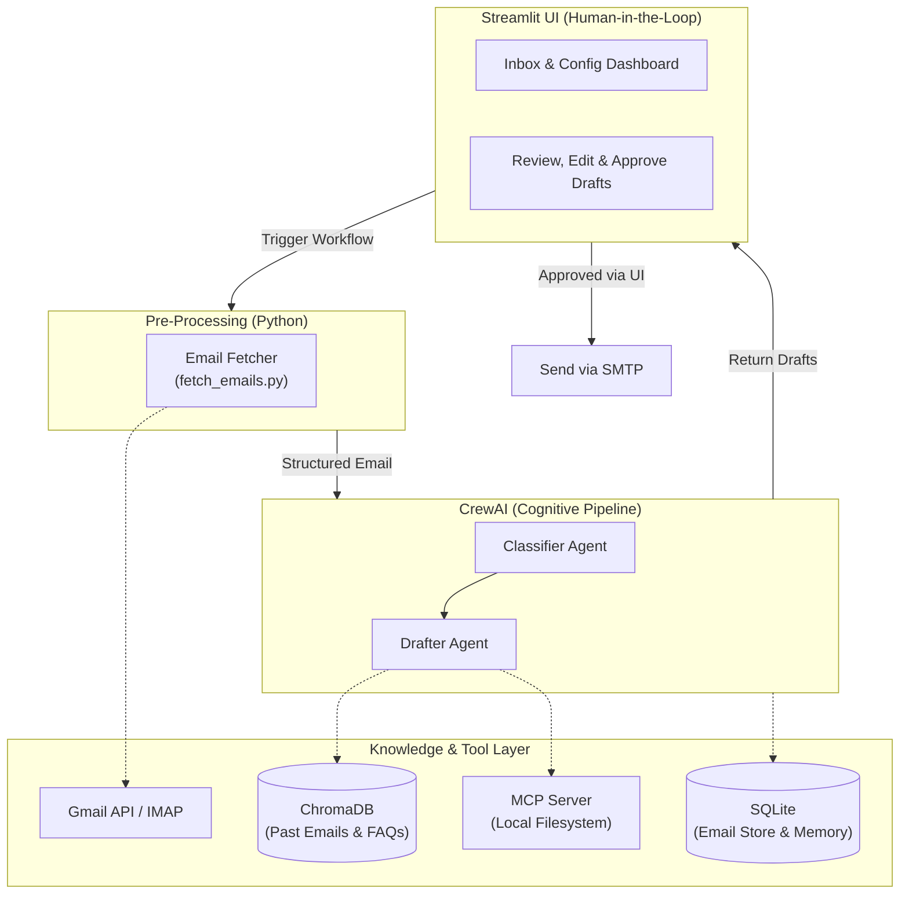

# PolyU — Agentic AI Email Assistant
> **Final Year Project** · Department of Computing  
> An intelligent email agent powered by **agentic AI** that autonomously receives, analyzes, classifies, and responds to emails. Enhanced with **RAG (Retrieval-Augmented Generation)**, **Structured Output Validation**, and the **Model Context Protocol (MCP)** for secure, context-aware enterprise workflows.

[](https://www.python.org/)
[](https://docs.crewai.com/v1.15.9/)
[](https://docs.pydantic.dev/)
[](https://www.trychroma.com/)
[](https://modelcontextprotocol.io/)
[](https://streamlit.io/)

---

## Table of Contents
1. [Project Overview](#project-overview)
2. [Motivation & Objectives](#motivation--objectives)
3. [System Architecture](#system-architecture)
4. [CrewAI Multi-Agent Design & Structured Outputs](#crewai-multi-agent-design--structured-outputs)
5. [Core Workflow & Classification](#core-workflow--classification)
6. [Database & Knowledge Layer](#database--knowledge-layer)
7. [RAG, MCP & LLM Resilience (Key Highlights)](#rag-mcp--llm-resilience-key-highlights)
8. [Privacy, Security & Evaluation](#privacy-security--evaluation)
9. [Project Structure](#project-structure)
10. [Getting Started](#getting-started)
11. [Configuration](#configuration)
12. [Usage](#usage)
13. [Development](#development)
14. [Feature Roadmap](#feature-roadmap)
15. [Artifacts & Deliverables](#artifacts--deliverables)

---

## Project Overview

This project builds an **agentic AI email assistant** capable of autonomously managing email communication using a **deterministic fetch + multi-agent AI architecture**. Email retrieval (IMAP) is handled by a lightweight Python layer, while AI-powered classification and drafting are delegated to a crew of specialized agents.

To maintain simplicity, reliability, and ease of debugging, this project leverages a **CrewAI-Native Architecture**:
- **Python Fetcher:** Deterministic IMAP email retrieval — no LLM tokens wasted on mechanical operations.
- **CrewAI (Core Engine):** Manages AI reasoning (Classifier, Drafter) and tool execution in a sequential pipeline.
- **Streamlit (Human-in-the-Loop):** Acts as the UI layer, pausing the final dispatch to allow users to review, edit, approve, or reject AI-generated drafts.

---

## Motivation & Objectives

In modern workplaces, professionals spend a significant portion of their day sorting and replying to emails. This project explores how **agentic AI** can:
1. **Reduce manual email overhead** by automating classification and drafting.
2. **Eliminate LLM Hallucinations** by grounding AI responses in real company data via RAG.
3. **Showcase Multi-Agent Collaboration** using CrewAI's role-based, sequential task architecture.
4. **Demonstrate Production-Ready AI** by implementing token safety caps, timeout handling, and strict Human-in-the-Loop safety checks.
5. **Deliver a working FYP demo** that satisfies all academic requirements for autonomous task completion with measurable results.

---

## System Architecture



### Architecture Explained

The system separates deterministic and AI workloads:
1. **Python Fetcher** retrieves emails via IMAP and outputs structured metadata.
2. **CrewAI** handles the AI pipeline (Classify → Draft) sequentially.
3. **Streamlit** catches the draft, renders it for human approval, then sends via SMTP.

---

## CrewAI Multi-Agent Design & Structured Outputs

The email processing pipeline consists of a deterministic Python fetch layer followed by a CrewAI crew of two AI agents:

### Pre-Processing: Email Fetcher

Email retrieval is handled by `email_fetcher.py` — a plain Python module that:
- Connects to IMAP/Gmail API to pull unread emails
- Extracts structured metadata (sender, subject, body, timestamp)
- Passes cleaned data to the AI pipeline

This keeps LLM calls focused purely on reasoning tasks.

### Agent Roles

| Agent Role | Goal | Tools |
| --- | --- | --- |
| **Classifier** | Analyze intent, sentiment, urgency; assign specific categories. | None (LLM reasoning) |
| **Drafter** | Generate context-aware reply drafts matching professional tone. | RAG, MCP tools |

### Task Flow & Structured Validation

To ensure high system reliability, the classification task leverages **Pydantic Structured Outputs**, forcing the LLM to return strictly validated JSON data rather than unstructured text.

```python
from pydantic import BaseModel, Field

class EmailClassification(BaseModel):
    intent: str = Field(description="Detected category: urgent, meeting, inquiry, spam, etc.")
    urgency_score: int = Field(description="Urgency scale from 1 to 10")
    summary: str = Field(description="1-sentence summary of the email content")
    requires_reply: bool = Field(description="Whether a reply draft is needed")

```

---

## Core Workflow & Classification

### Email Classification Categories

| Category | Description | Auto-Reply Strategy |
| --- | --- | --- |
| **urgent** | Requires immediate attention | Flag for human review, draft holding response |
| **meeting** | Meeting invitations, scheduling | Draft acceptance/tentative based on schedule |
| **inquiry** | Questions, requests for info | Draft reply using RAG (FAQ knowledge base) |
| **notification** | Automated system alerts | Archive only (no reply) |
| **spam** | Unsolicited or promotional | Move to spam folder |

---

## Database & Knowledge Layer

The project uses the following data stores:

### SQLite — Email Storage & CrewAI Memory

| Database | File | Purpose | Status |
| --- | --- | --- | --- |
| **Email Store** | `data/emails.db` | Persist fetched emails (sender, subject, body, classification, reply draft) for UI rendering and history. | 🔜 Pending |
| **CrewAI Long-Term Memory** | `data/crew_memory.db` | SQLite-backed long-term memory for CrewAI, persisting agent insights across sessions. Enable with `memory=True` on the Crew. | 🔜 Pending |

### ChromaDB — RAG Vector Store

| Component | Purpose | Status |
| --- | --- | --- |
| **Past Emails Index** | Embed and index historical emails for context-aware reply generation. | 🔜 Pending |
| **FAQ Knowledge Base** | Index company FAQs and policy documents to ground AI responses and eliminate hallucinations. | 🔜 Pending |
| **Embedding Provider** | Configurable via `EMBEDDING_PROVIDER` (ollama / openai). Local embeddings keep all data on-premises. | Config ready |

### Database Configuration (Planned)

```dotenv
# SQLite paths (auto-created on first run)
SQLITE_EMAIL_DB=data/emails.db
SQLITE_MEMORY_DB=data/crew_memory.db

# ChromaDB (RAG vector store)
CHROMA_PERSIST_DIR=data/chroma_db
CHROMA_COLLECTION_NAME=email_knowledge

# Embedding model for RAG
EMBEDDING_PROVIDER=ollama
EMBEDDING_BASE_URL=http://localhost:8080/
EMBEDDING_MODEL=qwen3-embedding-4b
```

---

## RAG, MCP & LLM Resilience (Key Highlights)

To elevate this project from a standard wrapper to an advanced AI application:

1. **Retrieval-Augmented Generation (RAG) & Embedding**
* Queries ChromaDB vector storage (with configurable chunks and embedding dimensions) to retrieve accurate context and FAQ snippets, completely eliminating LLM hallucinations.


2. **Model Context Protocol (MCP)**
* Safely exposes specific local directories to the Drafter Agent for secure, standardized file reading.


3. **Production-Ready LLM Guardrails (Timeout & Token Controls)**
* **Timeout Protection:** Configured with strict network timeouts to prevent agents from freezing during heavy API loads.
* **Token Capping:** Enforces maximum completion tokens to control costs and prevent runaway responses (hallucination loops) from local models.


---

## Privacy, Security & Evaluation

* **Zero Data Retention:** API calls to cloud providers use zero-retention headers where applicable.
* **Local Model Support:** Seamlessly switch to Ollama or local backends (e.g., Qwen) for secure processing of sensitive correspondence.
* **Evaluation Metrics:** System benchmarks on a test dataset measuring Classification Accuracy (>90%), RAG Hit Rate (>85%), and Human Acceptance Rate (HAR).

---

## Project Structure

```plaintext
email_assistant/
├── .env.example                  # Environment variable template
├── .env                          # Active environment config (git-ignored)
├── pyproject.toml                # Project dependencies (managed by uv)
├── README.md
├── knowledge/
│   └── user_preference.txt       # Static knowledge base content
├── tests/
│   ├── test_crew.py              # Crew assembly tests (LLM sharing)
│   └── test_service.py           # LLM provider configuration tests
└── src/
    └── email_assistant/
        ├── __init__.py
        ├── main.py               # Entry points (run, train, test, replay, trigger)
        ├── crew.py               # @CrewBase: Classifier & Drafter agents + tasks
        ├── models.py             # Pydantic models (EmailClassification)
        ├── service.py            # Multi-provider LLM configuration & validation
        ├── email_fetcher.py      # Deterministic email retrieval + sample data
        ├── config/
        │   ├── agents.yaml       # Agent definitions (classifier, drafter)
        │   └── tasks.yaml        # Task definitions (classify → draft)
        └── tools/
            ├── __init__.py
            └── custom_tool.py    # Placeholder (to be replaced with real tools)

```

---

## Getting Started

### 1. Clone & Install

```bash
git clone <repo-url>
cd email_assistant

# Install runtime and test dependencies using uv (creates .venv automatically)
uv sync --group dev

```

### 2. Configure Environment

```bash
cp .env.example .env

```

Edit `.env` with your credentials and safety constraints.

---

## Configuration

All settings use environment variables. Set `LLM_PROVIDER` to exactly one of
`local`, `openai`, `openrouter`, `anthropic`, `groq`, `deepseek`, or `google`.
Only the selected provider is validated, so local mode does not require remote
API keys.

### LLM Provider Selection

```dotenv
# Provider & safety guardrails
LLM_PROVIDER=local
LLM_TEMPERATURE=0.2
LLM_TIMEOUT=120
LLM_MAX_TOKENS=8000

# Local / OpenAI-compatible server (LM Studio, vLLM, llama.cpp, Ollama)
LOCAL_BASE_URL=http://localhost:8080/v1
LOCAL_MODEL=Qwen3.6-35B-A3B-UD-Q4_K_M.gguf
# LOCAL_API_KEY=sk-...           # Optional: for authenticated proxies/middleware

# OpenRouter Example
# OPENROUTER_API_KEY=sk-or-v1-xxxx
# OPENROUTER_BASE_URL=https://openrouter.ai/api/v1
# OPENROUTER_MODEL=openai/gpt-4o-mini

# OpenAI Example
# OPENAI_API_KEY=sk-...
# OPENAI_BASE_URL=https://api.openai.com/v1
# OPENAI_MODEL=gpt-4o-mini

# Anthropic Example
# ANTHROPIC_API_KEY=sk-ant-...
# ANTHROPIC_BASE_URL=https://api.anthropic.com
# ANTHROPIC_MODEL=claude-3-5-sonnet-20241022

# Groq Example
# GROQ_API_KEY=gsk_...
# GROQ_BASE_URL=https://api.groq.com/openai/v1
# GROQ_MODEL=llama-3.3-70b-versatile

# DeepSeek Example
# DEEPSEEK_API_KEY=sk-...
# DEEPSEEK_BASE_URL=https://api.deepseek.com
# DEEPSEEK_MODEL=deepseek-chat

# Google Gemini Example
# GOOGLE_API_KEY=...
# GOOGLE_MODEL=gemini-2.0-flash

```

### Email Configuration (Planned)

```dotenv
EMAIL_ADDRESS=your@gmail.com
EMAIL_PASSWORD=your-app-password    # Use Google App Password

```

### RAG & Embedding Configuration (Planned)

```dotenv
EMBEDDING_PROVIDER=ollama
EMBEDDING_BASE_URL=http://localhost:8080/
EMBEDDING_MODEL=qwen3-embedding-4b

```

### Database Configuration (Planned)

```dotenv
# SQLite
SQLITE_EMAIL_DB=data/emails.db
SQLITE_MEMORY_DB=data/crew_memory.db

# ChromaDB
CHROMA_PERSIST_DIR=data/chroma_db
CHROMA_COLLECTION_NAME=email_knowledge

```

---

## Usage

### CLI Mode

```bash
uv run crewai run

```

Runs the full pipeline: `fetch_emails()` → Classifier → Drafter. Processes all
sample emails defined in `email_fetcher.py`. The classification result is
validated against the `EmailClassification` Pydantic model, and the final draft
is written to `draft_reply.txt`.

### Streamlit UI (Planned)

```bash
uv run streamlit run src/email_assistant/ui/app.py

```

Open `http://localhost:8501`. Inbox tabs with unread counts, categorized
email lists, and an approval flow for AI-generated drafts.

---

## Development

### Run Tests

```bash
uv run pytest            # 39 tests, no API calls required

```

### Lint & Format

```bash
uv run ruff check .
uv run ruff format .

```

### Dependency Management

```bash
uv add <package>         # Add a new dependency
uv sync                  # Sync environment

```

---

## Feature Roadmap

* [x] Refactor to pure CrewAI structure (`crewai create crew`)
* [x] Multi-provider LLM configuration with timeout & token safety guards
* [x] YAML-based Agent & Task definitions (Classifier, Drafter)
* [x] Pydantic structured output (`EmailClassification`) for classification task
* [x] Optional `LOCAL_API_KEY` support for authenticated local proxies
* [x] Decouple email fetching from AI agents (`email_fetcher.py`)
* [x] File structure reorganization (`models.py`, `email_fetcher.py`)
* [ ] SQLite email store — persist fetched emails, classifications, and drafts
* [ ] CrewAI long-term memory via SQLite (`memory=True`)
* [ ] ChromaDB RAG integration — index past emails and FAQs
* [ ] Embedding pipeline — chunk documents, generate embeddings, store in ChromaDB
* [ ] MockEmailService — simulated inbox for offline testing
* [ ] Streamlit UI — inbox tabs with unread counts, review & approval flow
* [ ] Real IMAP/SMTP tools for Gmail integration
* [ ] MCP Server integration for local file access
* [ ] Final FYP Report & Evaluation generation

---

## Artifacts & Deliverables

Per FYP requirements, the following artifacts will be submitted:

1. **Source Code:** Modular Python system using modern tooling (uv, CrewAI, Streamlit).
2. **Agent Configurations:** Detailed YAML files outlining Agent cognitive pathways.
3. **Demo Application:** Streamlit dashboard demonstrating end-to-end automation with safety controls.
4. **Evaluation Report:** Statistical analysis of classification accuracy and RAG hit rate.
