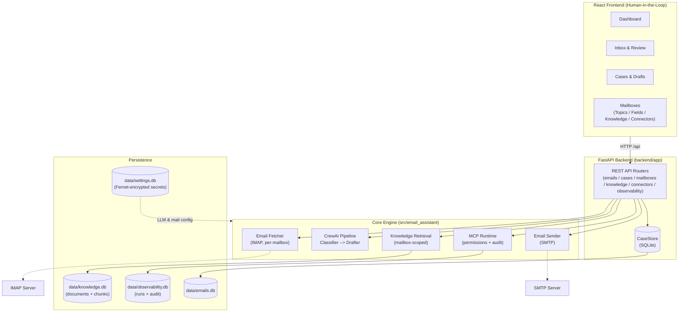

# PolyU — Agentic AI Email Assistant

> **Final Year Project · Department of Computing**

A human-supervised, multi-stage AI email assistant that combines
deterministic email processing with LLM-based reasoning.

The system retrieves emails through IMAP, classifies them using
schema-validated LLM outputs, generates response drafts, and requires
explicit human approval before SMTP delivery.

The project investigates the reliability, safety, and effectiveness of
agentic AI for practical email management, with structured output
validation, Human-in-the-Loop controls, and Retrieval-Augmented
Generation (RAG).

[](https://www.python.org/)
[](https://fastapi.tiangolo.com/)
[](https://react.dev/)
[](https://docs.crewai.com/)
[](https://docs.pydantic.dev/)
[](https://www.sqlite.org/)

---

## Table of Contents

1. [Project Overview](#project-overview)
2. [Problem Statement](#problem-statement)
3. [Research Questions & Measurable Objectives](#research-questions--measurable-objectives)
4. [Key Contributions](#key-contributions)
5. [System Architecture](#system-architecture)
6. [Why This Architecture?](#why-this-architecture)
7. [Multi-Mailbox Context Model](#multi-mailbox-context-model)
8. [Agentic Workflow](#agentic-workflow)
9. [Safety & Threat Model](#safety--threat-model)
10. [Evaluation Methodology](#evaluation-methodology)
11. [Preliminary / Final Results](#preliminary--final-results)
12. [Current Implementation Status](#current-implementation-status)
13. [Quick Start](#quick-start)
14. [Project Structure](#project-structure)
15. [Limitations](#limitations)
16. [Roadmap](#roadmap)
17. [References](#references)

---

## Project Overview

This project builds a **multi-mailbox agentic AI email assistant** that
separates deterministic software operations from probabilistic LLM reasoning.
Each **mailbox is an isolated business context** — with its own topics, custom
fields, knowledge base, connectors, and AI behaviour — so the same engine
serves Support, Sales, HR, etc. without cross-context leakage.

- **Python Fetcher (`core/email_fetcher.py`):** Deterministic per-mailbox IMAP retrieval via `imap-tools` — no LLM tokens spent on mechanical operations.
- **CrewAI Engine:** Staged LLM reasoning (Classifier → Drafter) with Pydantic-validated structured outputs.
- **Knowledge / RAG:** Mailbox-scoped indexing, chunking, embeddings, and retrieval that grounds the drafter.
- **MCP Runtime:** Connector tool discovery with default-deny permissions and audit logging.
- **FastAPI Backend (`backend/app/`):** REST API for email sync, AI processing, case management, and runtime settings — all state persisted in SQLite.
- **React Frontend (`frontend/`):** Human-in-the-Loop UI for reviewing, editing, approving, and sending AI-generated drafts.
- **Observability:** Per-stage processing runs recording latency, token usage, and failures.

### Research Focus

This project investigates three central challenges in practical
LLM-based email automation:

- the **reliability** of structured AI outputs;
- **grounding** generated replies in organisational knowledge;
- **safe control** of AI-generated external actions.

---

## Problem Statement

Email remains an important communication channel in modern organisations,
but managing high volumes of messages can create significant information and
workflow overhead.

Existing LLM-based email assistants introduce several technical challenges:

1. **Unreliable structured output** — free-form LLM responses may produce
   malformed or inconsistent data that cannot safely drive downstream
   workflows.

2. **Hallucination and insufficient grounding** — generated replies may
   contain information unsupported by organisational knowledge.

3. **Excessive AI autonomy** — allowing an LLM to directly perform external
   actions such as sending email can introduce safety risks.

4. **Unnecessary use of LLM reasoning** — deterministic operations such as
   email retrieval do not require probabilistic AI reasoning.

This project investigates a hybrid architecture that separates deterministic
operations from LLM reasoning and introduces structured validation, knowledge
grounding, and human approval.

---

## Research Questions & Measurable Objectives

### Research Questions

This project investigates the following questions:

**RQ1 — Classification Reliability**  
How accurately can LLMs classify incoming emails into predefined operational
categories?

**RQ2 — Structured Output Reliability**  
Does schema-constrained structured output reduce invalid or unparseable AI
responses compared with unconstrained generation?

**RQ3 — Retrieval-Augmented Generation**  
Does grounding email drafting with retrieved organisational knowledge improve
factual faithfulness and response relevance?

**RQ4 — Model Trade-offs**  
What trade-offs exist between classification quality, response quality,
latency, token usage, and cost across local and hosted LLMs?

**RQ5 — Safety**  
Can a Human-in-the-Loop architecture restrict potentially harmful agent
actions while preserving useful AI automation?

### Measurable Objectives

| ID | Objective | Evaluation |
|---|---|---|
| O1 | Classify emails into question, incident, problem, task and spam | Accuracy, Precision, Recall, Macro-F1 |
| O2 | Produce machine-readable classification output reliably | Structured-output validity rate |
| O3 | Generate useful and contextually appropriate reply drafts | Human evaluation + response relevance |
| O4 | Ground replies using organisational knowledge | Faithfulness, context precision and relevance |
| O5 | Prevent AI-generated replies from being sent without human approval | Safety/integration tests |
| O6 | Evaluate different LLM configurations | Quality, latency, token usage and cost |

---

## Key Contributions

The main contributions of this project are:

- A **hybrid deterministic–agentic architecture** separating mechanical email
  operations from LLM reasoning.
- A **multi-mailbox context model** where each mailbox is an isolated business
  context (topics, custom fields, knowledge, connectors, AI behaviour), enforced
  at the data, retrieval, tool, and observability layers.
- A **staged Classifier → Drafter workflow** with independently configurable
  LLM settings.
- **Schema-validated classification** using Pydantic with fallback handling
  for non-standard local-model outputs.
- **AI topic + custom-field extraction** with server-side validation and
  partial-success handling; manual values are protected from AI overwrites.
- **Retrieval-Augmented Generation** grounded in mailbox-scoped, indexed
  knowledge with provenance tracking and injection-safe prompts.
- **MCP tool permissions** with default-deny enforcement and audit logging.
- A **Human-in-the-Loop approval workflow** that separates AI-generated drafts
  from external email actions.
- **Runtime-selectable local and hosted LLM providers.**
- **Encrypted persistence** of email and AI configuration.
- An **observability layer** (per-stage latency and token usage) and an
  **evaluation framework** for classification, structured-output reliability,
  RAG quality, model latency, and safety.

---

## System Architecture



### How Data Flows

1. **Sync** — the backend triggers the deterministic per-mailbox fetcher, which
   pulls unread emails via IMAP and stores them as deduplicated tickets tagged
   with `mailbox_id`.
2. **Process** — the staged pipeline runs mailbox-scoped: the Classifier uses
   the mailbox's topics; knowledge is retrieved from the mailbox's own index;
   the Drafter grounds its reply in that context.
3. **Review & Send** — the human edits/approves the draft in the UI, then the
   backend sends it via SMTP using the enabled mail account.

---

## Why This Architecture?

### Why is email fetching deterministic?

Email retrieval through IMAP is a predictable software operation and does not
require semantic reasoning. Keeping it outside the LLM pipeline reduces
unnecessary model calls, latency, token usage, and non-deterministic behaviour.

### Why separate classification and drafting?

Classification and drafting have different objectives and evaluation criteria.
Separating them makes each stage independently observable, configurable,
testable, and replaceable.

### Why validate classification output?

Downstream application logic depends on predictable fields such as category,
priority and urgency. Structured validation creates an explicit contract
between the probabilistic LLM and deterministic application code.

### Why Human-in-the-Loop?

Generating a draft and performing an external action are treated as different
trust boundaries. The AI may propose a response, but the user retains
authority over sending it.

The pipeline is therefore **hybrid deterministic–agentic**, not "everything is
AI":

```text
deterministic (IMAP fetch)
        ↓
AI reasoning (classify → draft)
        ↓
deterministic (SMTP send, after human gate)
```

---

## Multi-Mailbox Context Model

A mailbox is an **isolated business context**, not just an email account. Each
mailbox owns its own taxonomy and grounding, and `mailbox_id` is enforced as a
hard boundary at every layer:

```text
Mailbox
  ├── Topics        → constrain the classifier (resolve + validate)
  ├── Custom Fields → typed, validated, partial-success extraction
  ├── Knowledge     → mailbox-scoped indexing + retrieval (RAG)
  ├── Connectors    → default-deny tool permissions + audit
  └── AI Behaviour  → per-stage model / temperature / instructions
```

This means a Support mailbox sees only Support topics, retrieves only Support
knowledge, and can only invoke tools permitted to Support — verified by
cross-mailbox isolation tests.

---

## Agentic Workflow

The email processing pipeline consists of a deterministic fetch layer followed
by a staged crew of two LLM-backed stages:

### Pre-Processing: Email Fetcher

Email retrieval is handled by `core/email_fetcher.py` — a plain Python module
that:

- connects to IMAP (folder and max-emails configurable per mail account) and
  pulls unread emails;
- extracts structured metadata (sender, subject, body, timestamp) and inline
  attachments;
- passes cleaned data to the AI pipeline.

This keeps LLM calls focused purely on reasoning tasks.

### Agent Roles

| Stage | Task | Goal | Tools |
| --- | --- | --- | --- |
| **Classifier** | `classify_email_task` | Determine category (question/incident/problem/task/spam), topic, priority, urgency, and summary. | None (LLM reasoning) |
| **Drafter** | `draft_reply_task` | Generate context-aware reply drafts matching professional tone, grounded in retrieved knowledge. | RAG knowledge context |

Each stage gets its own LLM instance with **per-stage overrides** (temperature,
max tokens, even role/backstory) stored in the settings DB — YAML config in
`config/agents.yaml` / `config/tasks.yaml` provides the defaults.

### Structured Validation

The classification task uses **Pydantic Structured Outputs**, forcing the LLM
to return strictly validated JSON. A tolerant fallback parser
(`core/classification_parser.py`) recovers classifications from local models
(e.g. Qwen3) that emit Python-literal style output instead of clean JSON.

```python
from pydantic import BaseModel, Field


class EmailClassification(BaseModel):
    category: str = Field(description="question, incident, problem, task, or spam")
    topic: str = Field(description="What the email is about, e.g. refund, bug_report, password_reset")
    priority: str = Field(description="low, normal, high, or urgent")
    urgency_score: int = Field(description="Urgency scale from 1 to 10")
    summary: str = Field(description="1-sentence summary of the email content")
    requires_reply: bool = Field(description="Whether a reply draft is needed")
```

> **Note:** `status` is intentionally **not** part of the AI classification
> output — it is a workflow state managed by humans/automations, not something
> the LLM should decide.

### Email (Ticket) Data Model

Each incoming email is treated as a **ticket**:

| Field | Meaning | Values | Set by |
| --- | --- | --- | --- |
| **status** | Lifecycle stage of the ticket | `new` → `processed` → `sent` (workflow states in DB) | Workflow (not AI) |
| **priority** | How urgent it is | `low` / `normal` / `high` / `urgent` | AI suggests, human can override |
| **category** | What *kind* of request it is (stable, small set) | `question` / `incident` / `problem` / `task` / `spam` | AI (classifier) |
| **topic** | What the email is *about* (open-ended subject matter) | `refund`, `bug_report`, `password_reset`, `lead`, … | AI (classifier) |
| **urgency_score / summary / requires_reply** | Auxiliary classification signals | 1–10 / text / bool | AI (classifier) |

### Classification Categories

The **category** field is kept small and stable:

| Category | Description | Auto-Reply Strategy |
| --- | --- | --- |
| **question** | A question or request for information | Draft reply using knowledge base (planned: RAG FAQ) |
| **incident** | A single occurrence of a problem | Flag for human review, draft holding response |
| **problem** | A larger issue affecting many | Flag for human review |
| **task** | Assignable action item | Draft acceptance/tentative response |
| **spam** | Unsolicited or promotional | Flag, no reply |

---

## Safety & Threat Model

Incoming emails, retrieved knowledge documents, and tool results are treated as
**untrusted input**. Each mailbox is a hard security boundary.

### Main Risks

| Risk | Mitigation |
|---|---|
| Prompt injection in email content | Email text is treated as data, not trusted system instructions |
| Prompt injection in knowledge / tool results | Knowledge and tool output are wrapped as data, not instructions |
| Hallucinated classification | Structured schema validation |
| Hallucinated topic / field values | Topic resolution + server-side field validation (partial success) |
| Hallucinated reply content | Human review + RAG grounding with provenance |
| Excessive agent authority | AI cannot directly send email; MCP tools default-deny |
| Cross-mailbox data leakage | `mailbox_id` enforced across emails, cases, knowledge, connectors, runs |
| Credential disclosure | Secrets encrypted at rest, masked in API responses, redacted in audit |
| Runaway model execution | Token limits and request timeouts |
| External-model privacy | Provider is configurable; local models are supported |

The system follows a **least-authority** design: AI components may propose
actions, while external side effects remain under deterministic application and
human control.

---

## Evaluation Methodology

| Experiment | Baseline / Comparison | Metrics |
| --- | --- | --- |
| Email Classification | Different models / prompts | Accuracy, Macro-F1, Precision, Recall, Confusion Matrix |
| Structured Output | Free-form vs JSON prompt vs schema validation | Valid-output rate, parse failures |
| Draft Generation | LLM-only vs RAG | Correctness, relevance, completeness |
| RAG Retrieval | Different retrieval settings | Context Precision / Recall |
| RAG Generation | No-RAG vs RAG | Faithfulness, Answer Relevancy |
| Model Comparison | Local vs hosted LLM | Quality, latency, tokens, estimated cost |
| Safety | Adversarial / prompt-injection test cases | Unsafe-action rate, approval-bypass rate |

RAG is introduced as an **experimental grounding mechanism** rather than merely
an additional feature. The planned comparison is:

```text
No RAG:  Email → LLM → Draft
   vs.
RAG:     Email → Retrieve company knowledge → LLM → Draft
```

Evaluation will use RAG-specific metrics such as `context_precision`,
`faithfulness`, and `answer_relevancy` (via Ragas).

---

## Preliminary / Final Results

Evaluation is in progress. Results will be reported here once experiments are
complete.

---

## Current Implementation Status

| Component | Status | Evaluation |
| --- | --- | --- |
| IMAP email retrieval (per-mailbox) | ✅ Implemented | Unit / integration tested |
| Multi-mailbox isolation | ✅ Implemented | Cross-mailbox isolation tested |
| Email classification | ✅ Implemented | 🔄 Evaluation pending |
| Structured output | ✅ Implemented | 🔄 Comparative evaluation pending |
| Topic resolution | ✅ Implemented | Unit tested |
| Custom fields (typed + validated) | ✅ Implemented | Unit tested |
| AI field extraction (partial success) | ✅ Implemented | Unit tested |
| Knowledge indexing / chunking | ✅ Implemented | Unit tested |
| Knowledge retrieval (mailbox-scoped) | ✅ Implemented | 🔄 Benchmark pending |
| RAG → Drafter | ✅ Implemented | 🔄 Evaluation pending |
| Human approval | ✅ Implemented | 🔄 Safety testing pending |
| SMTP delivery | ✅ Implemented | Integration tested |
| MCP permissions / audit | ✅ Implemented | Unit tested |
| Real MCP transport | 📋 Planned | Not implemented |
| Observability (runs / latency / tokens) | ✅ Implemented | Unit tested |
| Real semantic embedding provider | 📋 Planned | Hashing provider used for tests |
| Long-term memory | 📋 Planned | Not evaluated |

---

## Quick Start

### Prerequisites

- Python ≥ 3.10 with [uv](https://docs.astral.sh/uv/)
- Node.js ≥ 20 (for the frontend)

### 1. Clone & Install

```bash
git clone <repo-url>
cd email_assistant

# Install Python runtime and test dependencies using uv (creates .venv automatically)
uv sync --group dev

# Install frontend dependencies
cd frontend && npm install && cd ..
```

### 2. Configure Environment

```bash
cp .env.example .env
```

Edit `.env` with your credentials — or configure everything (LLM + mail
accounts) at runtime through the Settings UI.

### 3. Run

```bash
# Terminal 1 — backend API (http://localhost:8000)
uv run api

# Terminal 2 — frontend dev server (http://localhost:5173, proxies /api to :8000)
cd frontend && npm run dev
```

Open `http://localhost:5173`.

### Run Tests

```bash
uv run pytest            # 194 tests (core + backend API), no real API calls required
```

For the full configuration reference, API reference, and development workflow,
see [`docs/DEVELOPMENT.md`](docs/DEVELOPMENT.md) and [`docs/API.md`](docs/API.md).

---

## Project Structure

```plaintext
email_assistant/
├── .env.example                    # Environment variable template
├── .env                            # Active environment config (git-ignored)
├── pyproject.toml                  # Python dependencies (managed by uv)
├── pytest.ini
├── knowledge/
│   └── user_preference.txt         # Static knowledge base content
├── docs/
│   ├── API.md                      # API reference
│   └── DEVELOPMENT.md              # Configuration & development guide
├── backend/
│   ├── app/
│   │   ├── main.py                 # FastAPI app factory, CORS, entry point (uv run api)
│   │   ├── schemas.py              # Pydantic request/response schemas
│   │   ├── store.py                # CaseStore wrapper over the email database
│   │   └── routers/
│   │       ├── emails.py           # Sync (IMAP fetch) + AI process endpoints
│   │       ├── cases.py            # Case listing, draft editing, field values, SMTP send
│   │       ├── mailboxes.py        # Mailboxes / topics / fields / knowledge / connectors
│   │       ├── knowledge.py        # Knowledge indexing + retrieval endpoints
│   │       ├── connectors.py       # MCP discovery / permissions / audit
│   │       ├── observability.py    # Processing runs + stats
│   │       ├── stats.py            # Dashboard statistics
│   │       └── settings.py         # AI configs / stage settings / mail accounts CRUD
│   └── tests/                      # FastAPI API tests (TestClient, temp DBs)
├── frontend/                       # React 19 + Vite + Tailwind 4 + shadcn/ui
│   ├── package.json                # npm scripts (dev / build / lint)
│   ├── vite.config.ts              # Dev server + /api proxy to backend
│   └── src/
│       ├── App.tsx                 # Route registration
│       ├── components/             # Sidebar, header, badges, case fields, empty state
│       ├── lib/                    # API client, shared types
│       └── pages/
│           ├── dashboard.tsx       # Stats + category chart + recent activity
│           ├── inbox.tsx           # Email list (master-detail), sync, AI process
│           ├── cases.tsx           # Cases table + case detail (draft / fields)
│           ├── mailboxes/          # Mailbox list, add, detail tabs
│           └── settings/           # ai-models.tsx, general.tsx
├── tests/                          # Core unit tests (fetcher, database, parser, …)
└── src/
    └── email_assistant/
        ├── main.py                 # CLI entry points (run, train, test, replay)
        ├── models.py               # Pydantic models (EmailClassification)
        ├── service.py              # Multi-provider LLM configuration & validation
        ├── agents/
        │   └── crew.py             # @CrewBase: Classifier & Drafter + tasks
        ├── core/
        │   ├── email_fetcher.py    # Deterministic per-mailbox IMAP retrieval
        │   ├── email_sender.py     # SMTP sending (SSL / STARTTLS)
        │   ├── database.py         # SQLite email store (tickets, field values)
        │   ├── settings_store.py   # SQLite settings store (encrypted secrets)
        │   ├── mailbox_context.py  # MailboxRuntimeContext service
        │   ├── topics.py           # Topic resolution + validation
        │   ├── field_validation.py # Custom field value validation
        │   ├── extraction.py       # AI extraction client abstraction
        │   ├── extraction_service.py # Topic + field extraction (partial success)
        │   ├── chunking.py         # Knowledge chunking
        │   ├── embeddings.py       # Embedding client abstraction + compat
        │   ├── knowledge_store.py  # Knowledge documents + chunks (SQLite)
        │   ├── knowledge_indexing.py # Indexing service (atomic replace)
        │   ├── knowledge_retrieval.py # Mailbox-scoped retrieval
        │   ├── rag.py              # Retrieval query builder + context format
        │   ├── mcp_runtime.py      # MCP client manager (transport abstraction)
        │   ├── tool_permissions.py # Default-deny tool permissions
        │   ├── observability.py    # Observer context manager
        │   ├── observability_store.py # Processing runs + tool audit
        │   ├── migrations.py       # Legacy mailbox backfill
        │   ├── classification_parser.py  # Tolerant classifier output parser
        │   └── stage_defaults.py   # YAML defaults + DB override merging
        ├── config/
        │   ├── agents.yaml         # Agent definitions (classifier, drafter)
        │   └── tasks.yaml          # Task definitions (classify → draft)
        └── tools/
            └── custom_tool.py      # Placeholder (to be replaced with real tools)
```

---

## Limitations

- The five-category classification taxonomy may not generalise to all
  organisations.
- Draft quality depends on the selected LLM and prompt configuration.
- Knowledge retrieval uses a deterministic hashing embedding client; a real
  semantic embedding provider is not yet integrated.
- Real MCP transport is not yet connected (permission/audit layer is ready).
- External LLM providers may introduce privacy and data-governance
  considerations.
- The current prototype does not provide enterprise-grade RBAC or multi-tenant
  isolation beyond the mailbox boundary.
- Human evaluation of generated drafts may contain subjective bias.

---

## Roadmap

- [x] Refactor to pure CrewAI structure (`crewai create crew`)
- [x] Multi-provider LLM configuration with timeout & token safety guards
- [x] YAML-based Agent & Task definitions (Classifier, Drafter)
- [x] Pydantic structured output (`EmailClassification`) + tolerant fallback parser
- [x] Real IMAP email retrieval (`imap-tools`, per-mailbox)
- [x] FastAPI backend + React frontend
- [x] SQLite email store (content-hash dedupe, mailbox-scoped)
- [x] SQLite settings store — AI configs, stage settings, mail accounts
- [x] Encrypted secret storage (Fernet) for API keys & mail passwords
- [x] SMTP sending of approved drafts (SSL / STARTTLS)
- [x] Multi-mailbox context model (`mailbox_id` as data boundary)
- [x] Topics → classifier runtime (resolve + validate)
- [x] Custom fields → case runtime (typed validation, cross-mailbox reject)
- [x] AI topic + custom-field extraction (partial success, manual-value protection)
- [x] Knowledge indexing — chunking + embeddings + atomic replace
- [x] Knowledge retrieval — mailbox-scoped + retrieval test UI
- [x] Embedding compatibility safety (model change → reindex)
- [x] RAG → Drafter with provenance + injection-safe prompt
- [x] MCP runtime — discovery, permissions, audit (default-deny)
- [x] Observability — processing runs, latency, token usage
- [ ] Real semantic embedding provider (OpenAI / Ollama)
- [ ] Real MCP transport (stdio / HTTP)
- [ ] CrewAI long-term memory via SQLite (`memory=True`)
- [ ] Evaluation experiments (classification, retrieval benchmark, RAG, safety)
- [ ] Final FYP Report

---

## References

1. [About the repository README file — GitHub Docs](https://docs.github.com/en/repositories/managing-your-repositorys-settings-and-features/customizing-your-repository/about-readmes)
2. [Managing Email Overload in the Workplace — McMurtry, 2014](https://onlinelibrary.wiley.com/doi/10.1002/pfi.21424)
3. [CrewAI Documentation](https://docs.crewai.com/core-concepts/Agents)
4. [LLM01:2025 Prompt Injection — OWASP Gen AI Security Project](https://genai.owasp.org/llmrisk/llm01-prompt-injection/)
5. [AI Risk Management Framework: Generative AI Profile — NIST](https://www.nist.gov/publications/artificial-intelligence-risk-management-framework-generative-artificial-intelligence)
6. [Context Precision — Ragas](https://docs.ragas.io/en/stable/concepts/metrics/available_metrics/context_precision/)
7. [Retrieval-Augmented Generation for Knowledge-Intensive NLP Tasks — Lewis et al., 2020](https://arxiv.org/abs/2005.11401)
